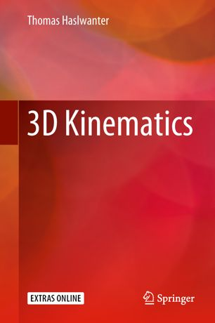

The book is now [available from
Springer](https://www.springer.com/in/book/9783319752761)

This repo has two folders, *python* and *matlab*, containing solutions to
the exercises in the book, and (for Python) code-listings, i.e. the Python
programs printed in the book.

The programing tools for analyizing and working with 3-D data can be found under

* for Python: [scikit-kinematics](https://github.com/thomas-haslwanter/scikit-kinematics)
* for Matlab: [3D-Kinematics toolbox](https://github.com/thomas-haslwanter/kinematics_toolbox.git)

## Errata
The file [Errata.pdf](Errata.pdf) contains a list of mistakes/changes in the manuscript, and
the corresponding corrections.
